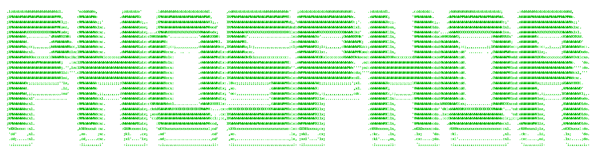
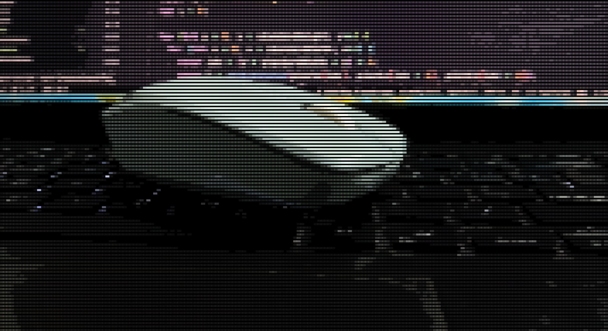
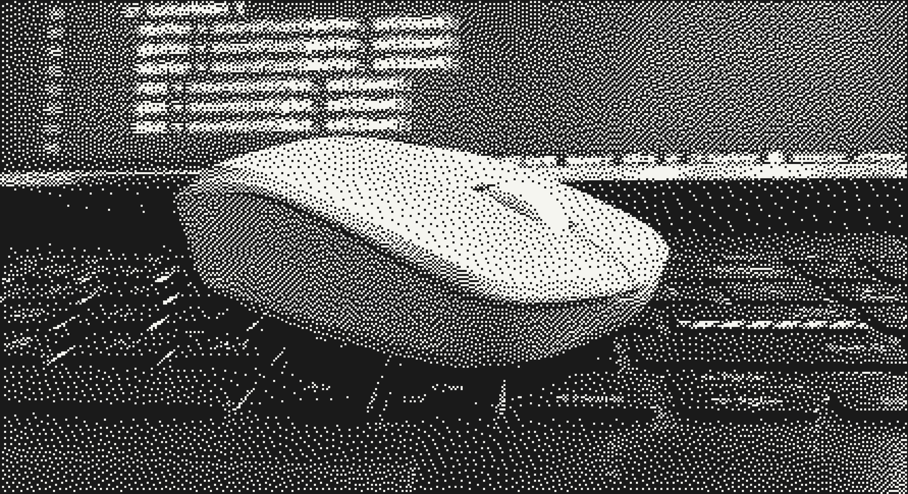
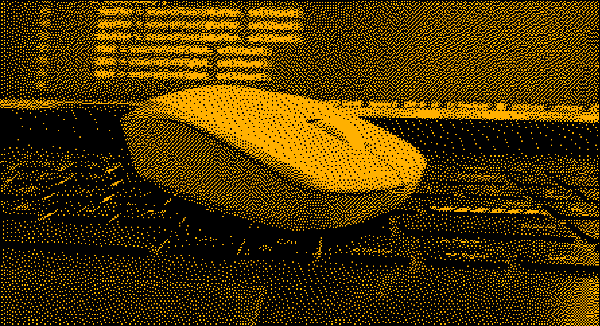
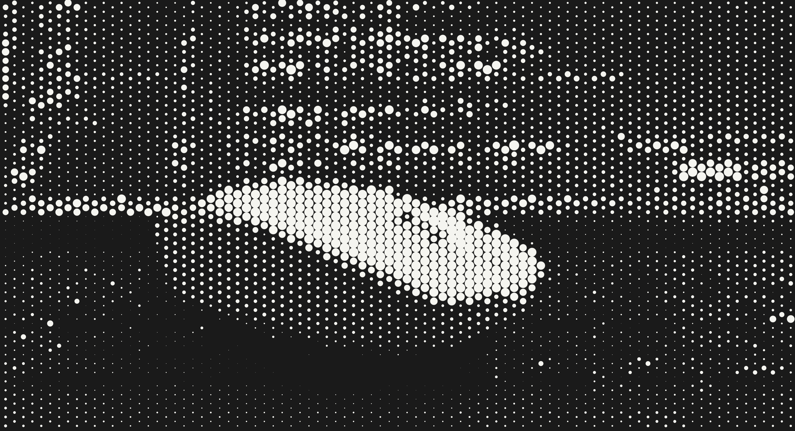
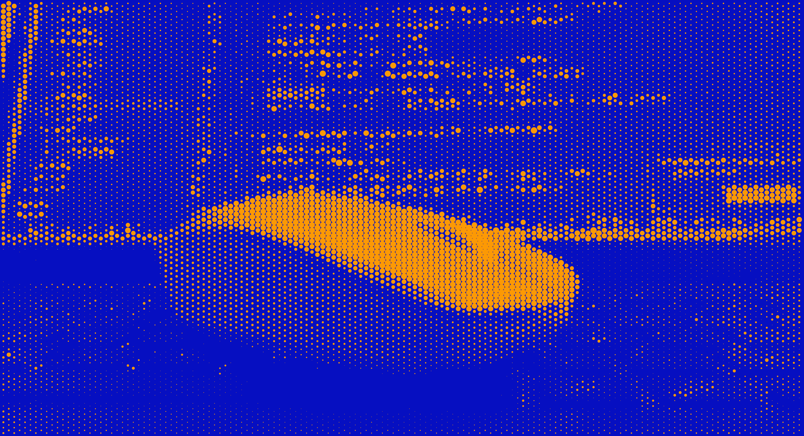
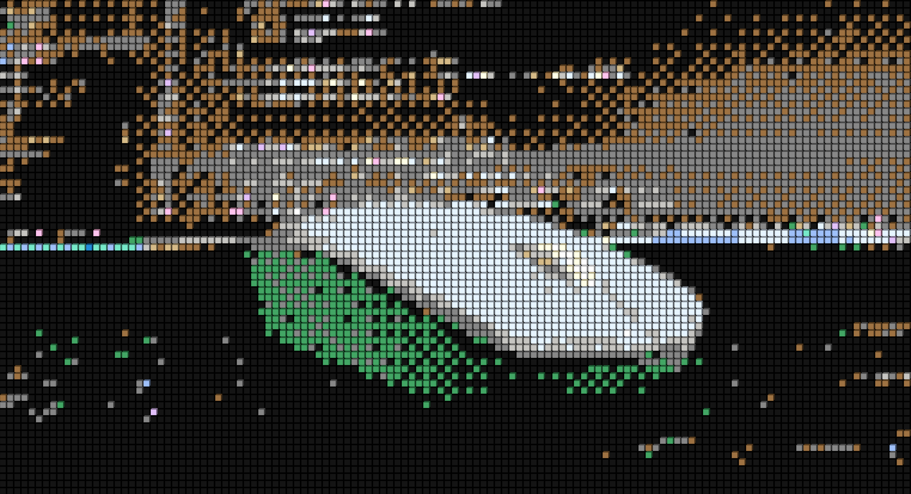
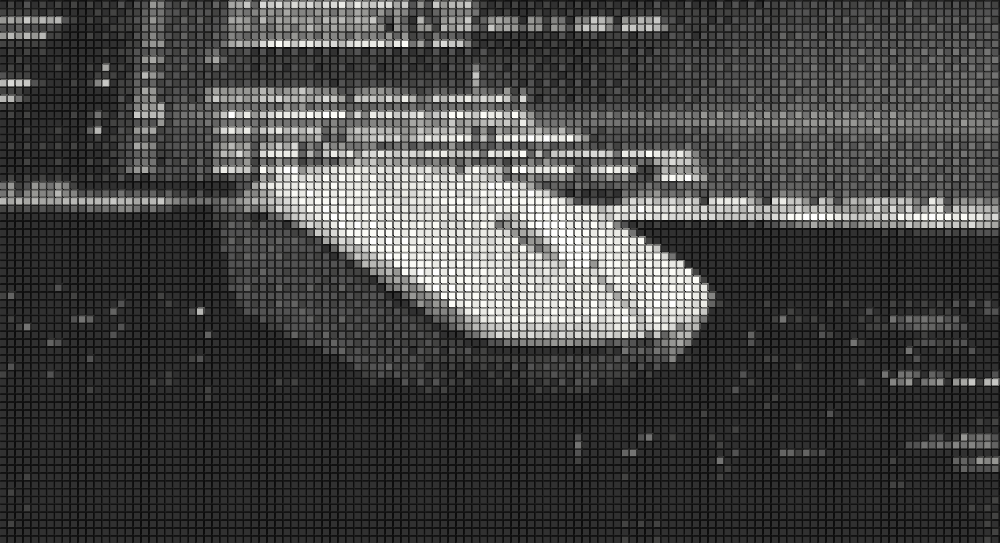
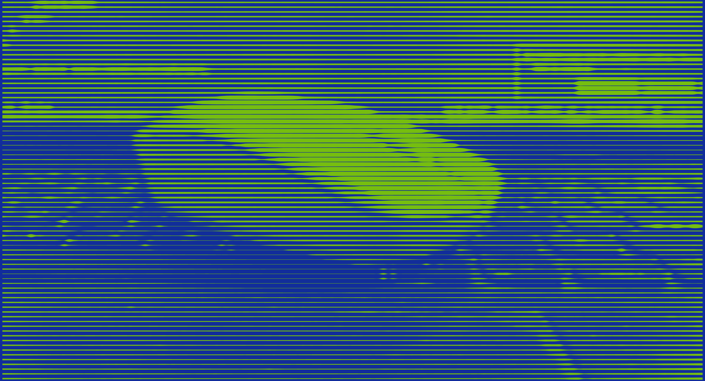
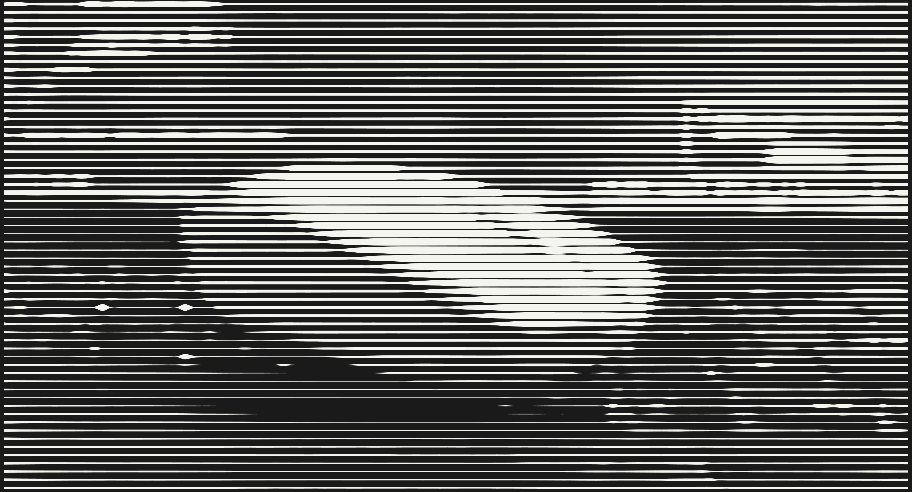

<div align="center">
  

# Phosphor Cam

  <p align="center">
    <i>Transform your camera feed into real-time ASCII art</i>
  </p>

[](https://github.com/pshycodr/phosphor-cam/stargazers)
[](https://github.com/pshycodr/phosphor-cam/network/members)
[](https://github.com/pshycodr/phosphor-cam/watchers)

[](https://opensource.org/licenses/MIT)
[](https://www.typescriptlang.org/)
[](https://github.com/pshycodr/phosphor-cam/actions/workflows/ci.yml?query=branch%3Amain)

</div>

---

## Overview

Phosphor Cam converts a live camera stream into stylized text or dithered bitmap graphics on an HTML canvas. It runs entirely client-side: frames are read from the `MediaStream`, processed and drawn locally, and are never uploaded.

Two render engines are available and can be switched at runtime without restarting the camera:

| Engine       | Output                                                                        | Typical use                         |
| ------------ | ----------------------------------------------------------------------------- | ----------------------------------- |
| **ASCII**    | Characters mapped to pixel luminance, optionally tinted with the source color | Text-art portraits, copyable output |
| **Dither**   | Reduced-tone bitmap rendering with a retro, print-like texture                | Stylized stills and video           |
| **Halftone** | Recreates an image as a grid of dots                                          | Stylized stills and video           |
| **Voxel**    | Render with pixeled effect and 3D blocks                                      | Stylized stills and video           |
| **Lines**    | Each row/column is one continuous ribbon                                      | Stylized stills and video           |

---

## Demo

### ASCII

<div align="center">
  
  
</div>

### Dither

<div align="center">
  
  
</div>

### Halftone

<div align="center">
  
  
</div>

### Voxel

<div align="center">
  
  
</div>

### Lines

<div align="center">
  
  
</div>

---

## Table of contents

- [Features](#features)
- [Getting started](#getting-started)
- [Usage](#usage)
- [Configuration](#configuration)
- [Architecture](#architecture)
- [Tech stack](#tech-stack)
- [Browser support](#browser-support)
- [Contributing](#contributing)
- [License](#license)

## Features

- **Real-Time Rendering**
  - Two interchangeable render engines: ASCII and Dither
  - Real-time processing with a target of 60 FPS on modern hardware
  - Live FPS, render time and output resolution readout
  - Five ASCII character sets: standard, simple, blocks, matrix and edges

- **High-Quality Capture**
  - Export 4K resolution ASCII art images
  - Video recording capability

- **Customizable Settings**
  - 5 character sets (standard, simple, blocks, matrix, edges)
  - Adjustable font size/resolution (6-30px)
  - Contrast and brightness controls
  - Color mode and invert options

- **Camera Controls**
  - Front/back camera switching
  - High-quality snapshot export
  - ASCII text copy to clipboard

- **Performance Monitoring** - Real-time FPS and render time display

---

## Getting started

### Prerequisites

- Node.js 18 or later
- A device with a camera
- A secure context (HTTPS or `localhost`), required by browsers for camera access

### Installation

```bash
git clone https://github.com/pshycodr/phosphor-cam.git
cd phosphor-cam
npm install
```

### Development

```bash
npm run dev
```

The app is served at `http://localhost:5173`.

### Production build

```bash
npm run build
npm run preview
```

## Usage

1. **Allow camera access** when the browser prompts.
2. **Select a render engine** (ASCII or Dither) in the settings panel.
3. **Tune the image** under Adjustments and Appearance. Changes apply to the live feed immediately.
4. **Capture** a frame with the shutter button, or copy it as text with the copy button.
5. **Switch cameras** with the flip button.

The settings panel appears as a bottom sheet on phones (swipe down or tap outside to close) and as a side panel on larger screens (press `Esc` to close).

## Configuration

| Setting                   | Range / options                         | Engine |
| ------------------------- | --------------------------------------- | ------ |
| Render engine             | ASCII, Dither                           | All    |
| Character size            | 2 to 30 px                              | All    |
| Contrast                  | 0.5x to 3.0x                            | All    |
| Brightness                | -100 to +100                            | All    |
| Character set             | standard, simple, blocks, matrix, edges | ASCII  |
| Color mode                | On / off                                | All    |
| Foreground and background | Any hex color, or one of six presets    | All    |
| Invert                    | On / off                                | All    |

Character size controls how large each output cell is: larger values produce fewer, coarser cells, and smaller values produce finer detail at a higher processing cost.

## Architecture

Rendering is decoupled from the UI. Each engine implements a common renderer interface and is registered by render mode, so adding an engine does not require changes to the frame loop or the interface.

```
src/
├── components/     UI: viewport, camera controls, header, settings panel
├── core/
│   └── renderers/  Render engines and the registry that maps mode to engine
├── hooks/          Camera source and frame loop
├── store/          Settings and performance stats
├── constants/      Character sets
└── types/          Shared types
```

Frame flow: the camera stream is read through `useCameraSource`, `useFrameLoop` schedules each frame, and the active renderer from the registry draws it to the canvas. Settings are read from the store on every frame, so changes take effect without recreating the renderer.

## Tech stack

- **React** and **TypeScript**
- **Vite**
- **Tailwind CSS**
- **Canvas 2D API** for rendering
- **MediaStream API** for camera access
- **Lucide** and **React Icons** for iconography

## Browser support

Requires `getUserMedia`, Canvas 2D and ES2020+ support.

| Chrome | Firefox | Safari | Edge |
| ------ | ------- | ------ | ---- |
| 90+    | 88+     | 14+    | 90+  |

## Contributing

Contributions are welcome. Please read [CONTRIBUTING.md](CONTRIBUTING.md) before opening a pull request.

1. Fork the repository
2. Create a feature branch: `git checkout -b feature/short-description`
3. Commit your changes with a clear message
4. Push the branch and open a pull request

To report a defect or propose a feature, [open an issue](https://github.com/pshycodr/phosphor-cam/issues).

## License

Released under the MIT License. See [LICENSE](LICENSE) for details.
